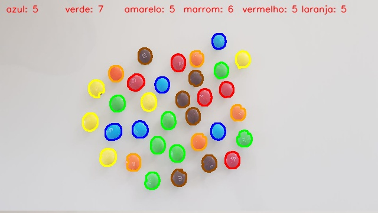

# Detecção e Contagem de Objetos com OpenCV

Esse projeto processa duas imagens diferente e tem como objetivo segmentar os objetos da imagem e realizar a contagem de ambos.

## Descrição

Este projeto tem como objetivo demonstrar como realizar o processamento de imagens utilizando a biblioteca OpenCV em Python. O foco principal é identificar, segmentar, contar e marcar objetos específicos em uma imagem, especificamente M&Ms, utilizando técnicas de visão computacional. Durante o processo, a imagem original pode conter "ruídos" (como milho e feijão) que são tratados para garantir a contagem precisa dos M&Ms.

## Tecnologias Utilizadas

- **Python**: Linguagem de programação.
- **OpenCV**: Biblioteca utilizada para processamento de imagens e visão computacional.
- **NumPy**: Biblioteca usada para manipulação de matrizes, necessária para algumas operações morfológicas.

## Funcionalidades

- **Carregamento de imagem**: A imagem a ser processada é carregada do sistema de arquivos.
- **Redimensionamento da imagem**: A imagem é redimensionada para melhorar a performance.
- **Conversão de BGR para HSV**: A imagem é convertida para o espaço de cores HSV para facilitar a identificação de objetos.
- **Criação de Máscaras**: Máscaras são criadas para identificar as cores dos objetos desejados (M&Ms) na imagem.
- **Operações Morfológicas**: Dilatação e erosão para tratar os ruídos e melhorar a segmentação dos objetos.
- **Contagem e Contornos**: A contagem dos objetos é feita utilizando a detecção de contornos e a área dos objetos identificados.
- **Exibição de Resultado**: Exibição da imagem com os objetos detectados e a contagem de M&Ms por cor.

## Passos para Execução

1. **Instalação das Bibliotecas**:
   
   Primeiro, instale as dependências necessárias utilizando o seguinte comando:
   
   ```bash
   pip install opencv-python numpy


## Imagens de Entrada

### Células


### MM's


## Imagens de Saída

### Células


### MM's



